Let's talk about memes.

[ Umbraco themed memes ]

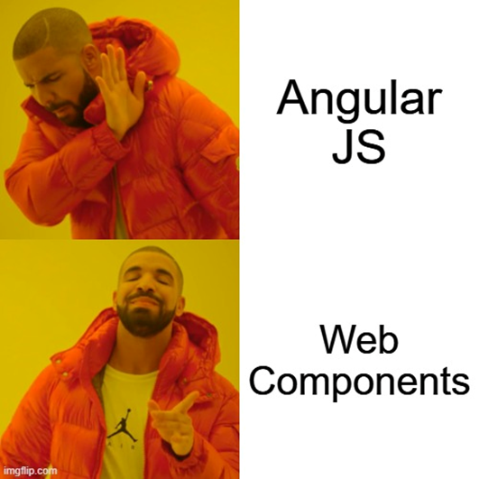

Internet memes, in this static image with text format, are fascinating to me. They're clearly understandable, provide a high-level overview of a perspective, take little effort to make and are easy to distribute. Plus, these memes are, in themselves, [memes](https://en.wikipedia.org/wiki/Meme), but that's for another blog.

But there's one meme which has haunted me for a long while now, and it is this:

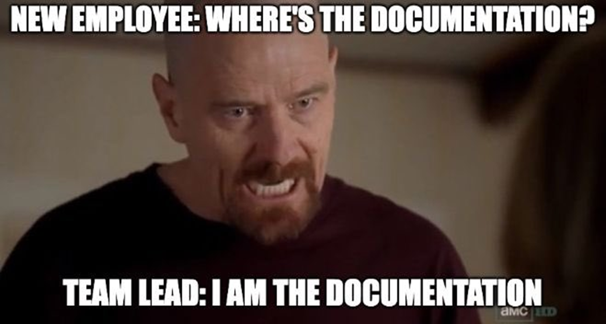

I've talked about this meme for a long while now, at events in [Cardiff](https://youtu.be/tLUzy77B6zA), [Bristol](https://youtu.be/DYhIDSFs7Zs) and [London](https://youtu.be/yEtDQRSHTx8) - and by gum did it put them on the map! This meme's largely featured while I extoll the virtues of process mapping - creating high-level visual representations of workflows to codify a process in an easily understood, easily shared format. This meme specifically represents a problem I find whenever hearing stories from new starters, especially those who are new to their respective company - a mess of undocumentated processes and not knowing where to find answers. These are problems I can see largely being reduced through creating process maps. 

One of the main sticking points I've had with these talks are around business implementation of . While can I yell "Process maps are a good idea actually" into the wind, unless there's a way to incorporate the creation, sharing and updating of these process maps in an easy to use, developer-friendly fashion, then this concept just stays as being A Nice Idea.

And it turns out that other people have considered this too.

## Mermaid: Introduction

[Mermaid](https://github.com/mermaid-js/mermaid) (aka Mermaid.js) provides developers with a code-first approach to process mapping. Using a Markdown-inspired syntax, Mermaid renders code into an SVG image format to be displayed in browser or exported as a file. The mission statement is clear: "The main purpose of Mermaid is to help documentation catch up with development." ([README.md](https://github.com/mermaid-js/mermaid)).

Through enabling process maps to have a Markdown file as their source, Mermaid allows maps to be created by developers through code, rather than a graphics package. With native support within GitHub, GitLab and Azure DevOps, these files can be stored and read within the repo themselves, rather than requiring propritory software of licenses to access them. Mermaid's code-first nature also opens out the possibilities for automated tools and agents to generate and update the process maps, which in turn can be used to define and refine the codebase's core functionality. All this, without requring the developer to learn to use a graphics package - it's just more code.

Mermaid was also the winner of the [JS Open Source Awards (2019)](https://osawards.com/javascript/2019) award for "The most exciting use of technology" - which, when you consider the uses of, um, technology, that's pretty something.

## Mermaid: Syntax

_Disclaimer: due to the code->image nature of Mermaid rendering I'm going to be including code samples as images in this article. All code samples can be found in [this GitHub repo](https://github.com/jacksorjacksor/MermaidJs). Many more examples can be found in [the official documentation](https://mermaid.js.org/intro/)._

Mermaid provides support for a large number of different types of visualisations, including flowchart, class diagram (UML), Gitgraph, Gantt and entity relationship (ER). While they all have slightly different syntax, they are largely defined in the same manner. Here is a sample for a flowchart, with its code on the left and the rendered image on the right:

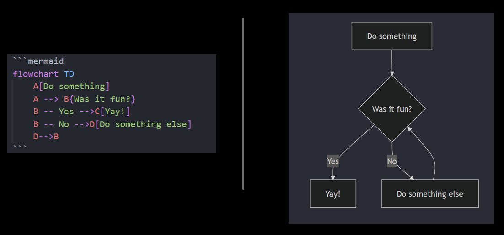

If we look at the above code in more details we can see the Mermaid syntax in action:

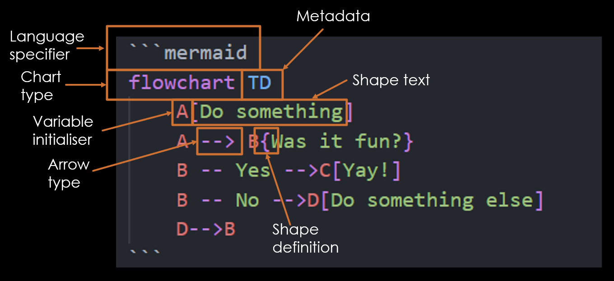

- Language specifier: informing the parser that the enclosed code is in Mermaid syntax
- Chart type: defining what type of chart the user wants to be rendered
- Metadata: extra details for that chart type (in this instance 'TD' represents 'Top Down', which is the direction that the flowchart will be rendering its objects)
- Variable initialiser: a reference to a Mermaid object
- Shape definition: the shape of that Mermaid object
- Shape text: the text contained within the Mermaid object
- Arrow type: the type of arrow which will connect different Mermaid objects

Regarding layout, Mermaid is *highly* opinionated, by design. While in the above example we can specify the rough direction of the chart (such as "Top Down" or "Left Right"), we have no other control over what is rendered where - we can't define an arrow's path, or precisely where a box is displayed.

The below image shows how we are able to define our variables either in-line (left) or before usage (right). This allows for a greater separation of concerns, as our "before usage" approach allows us to define their attributes (i.e. shapes and text) separately to their relationships (i.e. arrows). The below image shows the same code, writen in two different ways.

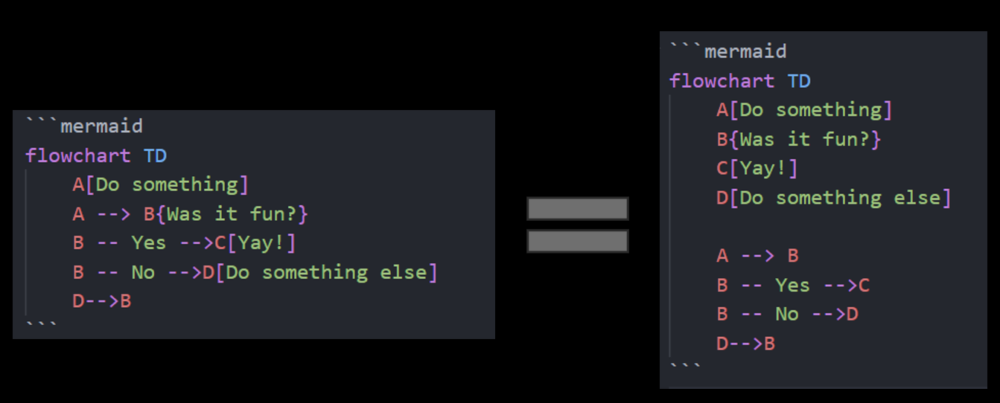

There's also a wide variety of shapes we're able to use, not just those defined by different types of brackets. To faciliate for these different shapes, we use a different syntax defined using "@{}". In the below image we see "manual-file", "manual-input" and "docs" shapes being used:

We are also able to change the colouring of objects using [themes](https://mermaid.js.org/config/theming.html). There are a number of pre-defined colour palettes which can be used in addition to a fully customisable "base" theme. The below image shows some basic base theme customisation within a pie-chart, defining our primary and secondary colours.

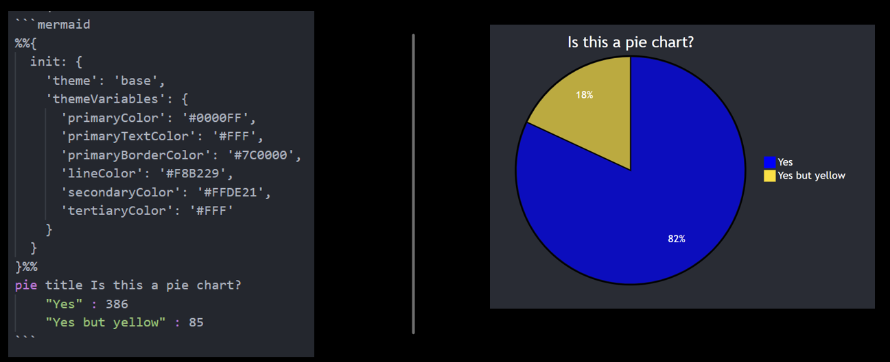

Mermaid offers an [API](https://mermaid.js.org/config/usage.html#api-usage) for allowing a callback function to be called on newly rendered graphs. It's also possible to bind events, such as tooltip and click events, to the graph, enabling hyperlink navigation when clicking certain objects.

Mermaid also has a [CLI tool](https://github.com/mermaid-js/mermaid-cli) which allows for functionality such as rendering out image files locally. 

The final Mermaid syntax feature I wanted to highlight was how one checks which versions of Mermaid they are currently rendering. Speaking from personal experience this is an essential feature to be made aware of! With Mermaid it's very straightforward to determine which version of Mermaid is currently being used for rendering - just use the word "info", as seen below:

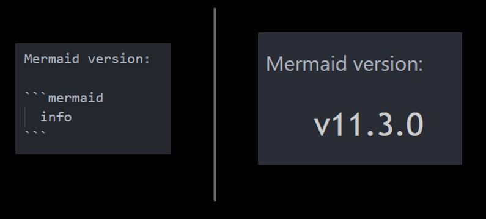

# Mermaid: Integrations

Mermaid has [integrations with numerous platforms](https://mermaid.js.org/ecosystem/integrations-community.html), allowing Mermaid to be rendered in many different settings and contexts. For this blog we'll look at three platfoms specifically - GitHub, Umbraco v13 (i.e. HTML/JS) and Mermaid Live Editor.

- GitHub

GitHub has natively supported Mermaid for any Markdown file since 2022, complete with a [blog post](https://github.blog/developer-skills/github/include-diagrams-markdown-files-mermaid/) with a Mermaid diagram showing how GitHub supports Mermaid.

To use Mermaid with GitHub, create a Markdown file and add code such as the below snippet.

-- SNIPPET: github_integration.md --

This will then render the Mermaid diagram, complete with a navigation widget.

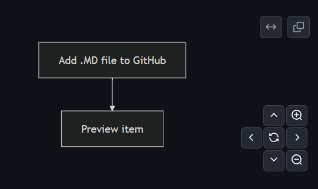

There's no built-in way to save the diagram as a static image (i.e. export as PNG), though this could potentially be achieved through some fun GitHub Actions + Mermaid CLI malarky.

- Umbraco v13 (HTML/JS)

Here is one of the many different ways to render a Mermaid diagram through Umbraco v13, using Razor pages for the front-end:

1. Create Markdown Content Editor

Create a Markdown Content Editor specifically to hold any Mermaid syntax. Adding the Mermaid language identifier is not required.

2. Razor Template - Handle

Render the contents of the Markdown Content Editor, using `Html.StripHtml()` to remove `
` tags.

-- SNIPPET: umbraco_v13_integration.cshtml --

3. Razor Template - Install & Import Mermaid 

Ensure that the page in question has access to the Mermaid package. You can install the Mermaid package through your [JavaScript package manager of choice](https://mermaid.js.org/config/usage.html#installing-and-hosting-mermaid-on-a-webpage), though for this example I'll be using the [CDN link](https://mermaid.js.org/config/usage.html#cdn). Here's a snippet which uses the CDN to import Mermaid.

-- SNIPPET: umbraco_v13_integration_cdn.cshtml --

4. ...it should just work?

That's all that should be required to render Mermaid through an Umbraco v13 site!

I'm sure there are all sorts of crazy ways that Umbraco can make use of Mermaid's API and CLI tools, so I'll leave those for the community to explore!

- Mermaid Live Editor

[Mermaid Live Editor](https://mermaid.live/) is a space for quickly creating and rendering Mermaid diagrams. The rendering on the right automatically syncs with the code on the left, providing a quick and easy location for creating Mermaid diagrams. There is also native support for exporting the diagrams as image files and support for GitHub Gists.

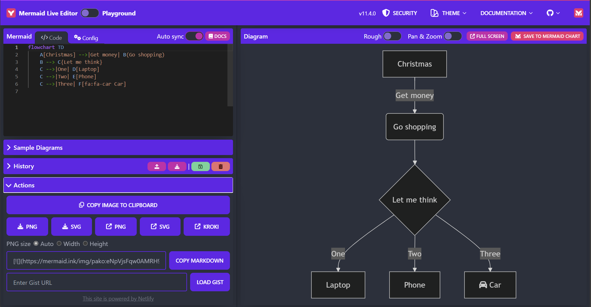

The Mermaid Live Editor is something of a taster of [Mermaid Chart](https://www.mermaidchart.com/), the commercialised side of Mermaid. While Mermaid itself is open-source and free for use, Mermaid Chart is a dedicated platform with paid tiers of use for tooling to support Mermaid usage and sharing.

## Mermaid + AI

Mermaid's syntax provides a shared point of reference between developer and AI agent. Mermaid Chart itself provides [native plug-ins](https://www.mermaidchart.com/plugins) for ChatGPT and GitHub Copilot, along with its own [Mermaid AI](https://www.mermaidchart.com/mermaid-ai).

Even without these dedicated plug-ins, AI tools such as Copilot can be used to generate Mermaid diagrams from natural language prompts. A potential workflow would be to use natural language to define business requirements, use an AI tool to create the Mermaid chart, then build the code based around the Mermaid chart. This process can then feed into itself to further refine the business requirements and codebase, becoming a natural part of the development cycle.

Here's a Mermaid diagram showing this, with code generated using Microsoft Copilot.

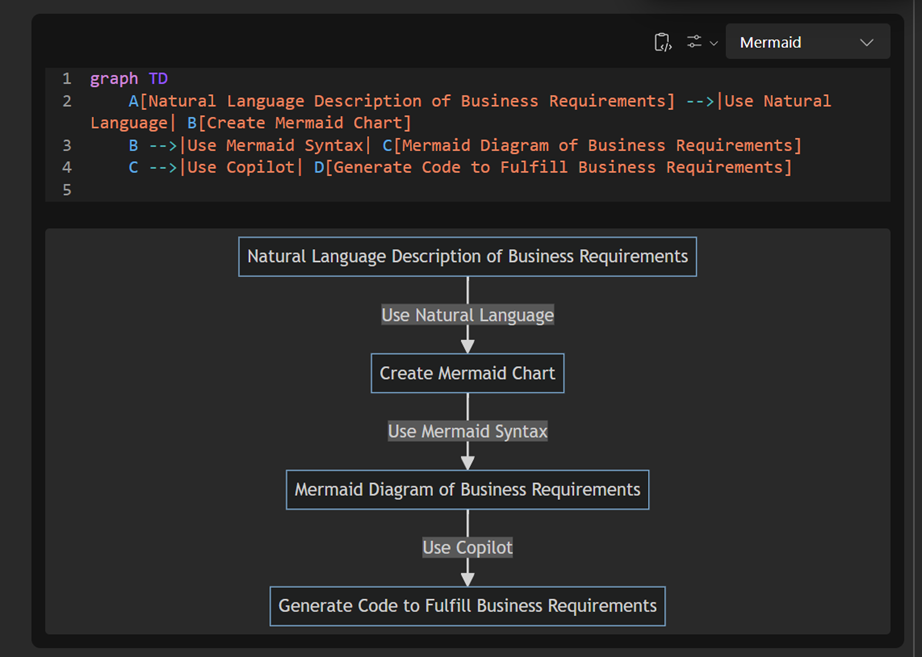

I asked Microsoft Copilot to provide some reasons for using Mermaid alongside Copilot - and while only the third point mentions Copilot, it was nice to see the results:

- Clarity and Precision: Mermaid diagrams can provide a clear and precise representation of business requirements, reducing the chances of misunderstandings or misinterpretations.

- Enhanced Collaboration: Visual diagrams can facilitate better collaboration among team members, as they provide a common reference point that is easy to understand.

- Streamlined Development: By using Copilot to generate code based on well-defined requirements, you can streamline the development process and ensure that the code aligns closely with the business needs.

- Improved Documentation: Mermaid diagrams can serve as part of the project documentation, making it easier to maintain and update the project in the future.

Another potential use would be to create a build action for an AI agent to review the codebase, determine whether the Mermaid chart still represented the code's functionality, and then update on either side - either the Mermaid diagram is out of doubt or the code is doing something it shouldn't do.

# Conclusion

The intention of this article has been to show how Mermaid can be used to incorporate the practice of process maps into a development life cycle. Mermaid can be used to create clearly understandable, high-level overviews which take little effort to make and are easy to distribute. 

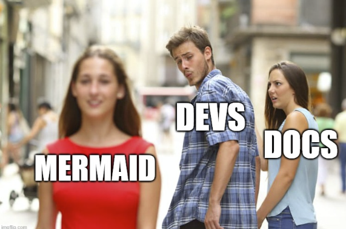

Links:

https://github.com/mermaid-js/mermaid

somewhere in here Callum talks about memes:
https://www.youtube.com/watch?v=w28tjmqiMe0