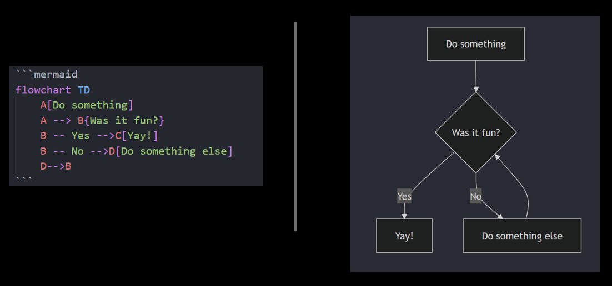
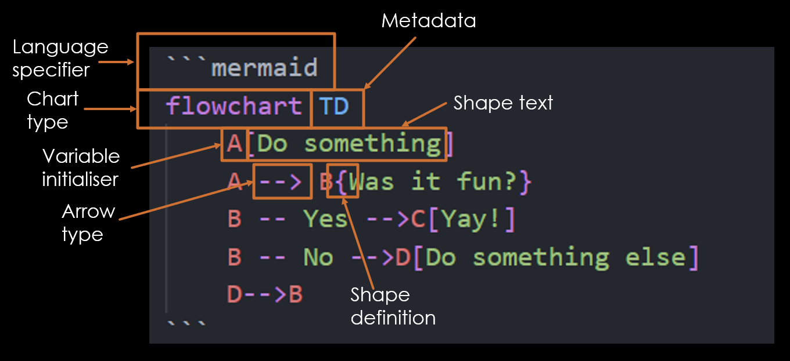
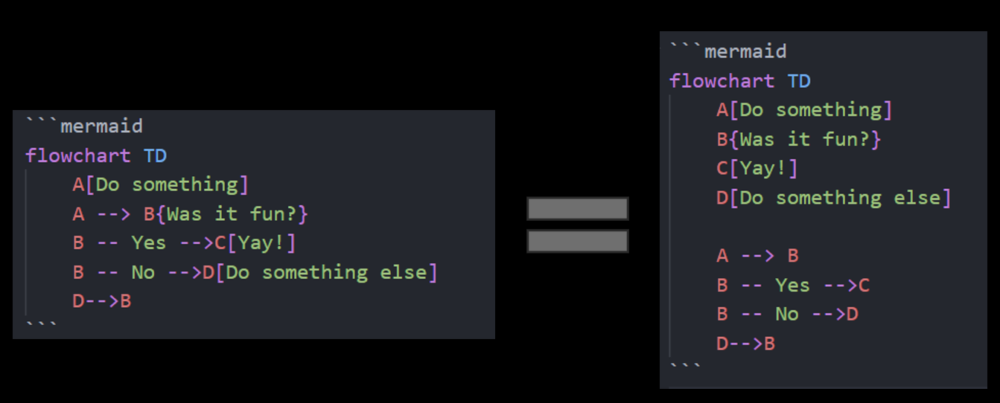
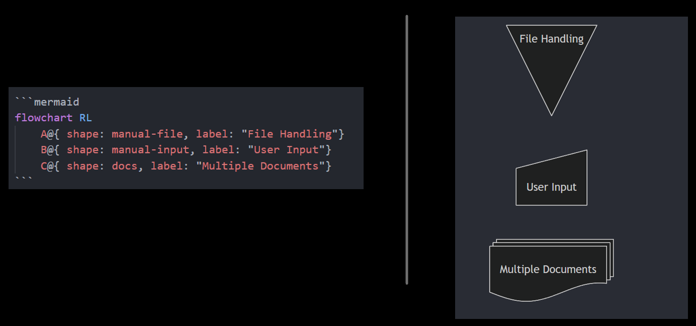
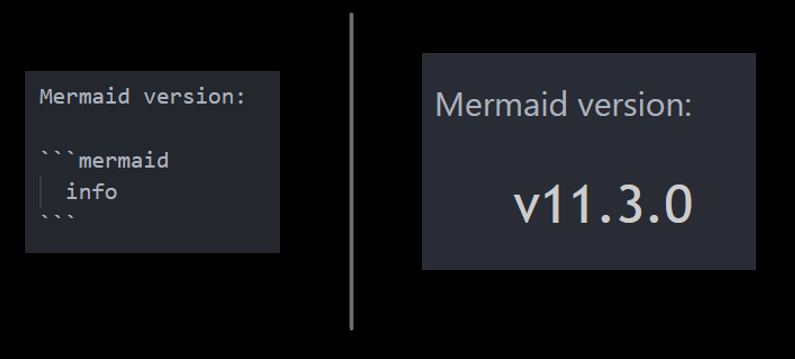
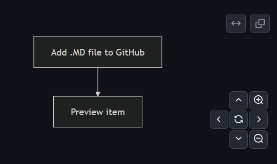

Let's talk about memes.

[ Umbraco themed memes ]

Memes are 

But there's one meme which has haunted me for a long while now, and it is this:

[ ]

I've talked about this meme for a long while now, at events in Cardiff, Bristol and London - and by gum did it put them on the map! This meme's largely featured while I extoll the virtues of process mapping - creating high-level visual representations of workflows to codify a process in an easily understood, easily shared format.

One of the main sticking points I've had with these talks are around business implementation of such a process. While can I yell "Process maps are a good idea actually" into the wind, unless there's a way to incorporate the creation, sharing and updating of these process maps in an easy to use, developer-friendly fashion, then this concept just stays as being A Nice Idea.

And it turns out that other people have considered this too.

# Mermaid: Introduction

[Mermaid](https://github.com/mermaid-js/mermaid) (aka Mermaid.js) provides developers with a code-first approach to process mapping. Using a Markdown-inspired syntax, Mermaid renders code into an SVG image format to be displayed in browser or exported as a file. The mission statement is clear: "The main purpose of Mermaid is to help documentation catch up with development." ([README.md](https://github.com/mermaid-js/mermaid)).

Mermaid was also the winner of the [JS Open Source Awards (2019)](https://osawards.com/javascript/2019) award for "The most exciting use of technology" - which, when you consider the uses of, um, technology, that's pretty something.

# Mermaid: Syntax

_Disclaimer: due to the code->image nature of Mermaid rendering I'm going to be including code samples as images in this article. All code samples can be found in [this GitHub repo](https://github.com/jacksorjacksor/MermaidJs). Many more examples can be found in [the official documentation](https://mermaid.js.org/intro/)._

Mermaid provides support for a large number of different types of visualisations, including flowchart, class diagram (UML), Gitgraph, Gantt and entity relationship (ER). While they all have slightly different syntax, they are largely defined in the same manner. Here is a sample for a flowchart, with its code on the left and the rendered image on the right:

If we look at the above code in more details we can see the Mermaid syntax in action:

- Language specifier: informing the parser that the enclosed code is in Mermaid syntax
- Chart type: defining what type of chart the user wants to be rendered
- Metadata: extra details for that chart type (in this instance 'TD' represents 'Top Down', which is the direction that the flowchart will be rendering its objects)
- Variable initialiser: a reference to a Mermaid object
- Shape definition: the shape of that Mermaid object
- Shape text: the text contained within the Mermaid object
- Arrow type: the type of arrow which will connect different Mermaid objects

Regarding layout, Mermaid is *highly* opinionated, by design. While in the above example we can specify the rough direction of the chart (such as "Top Down" or "Left Right"), we have no other control over what is rendered where - we can't define an arrow's path, or precisely where a box is displayed.

The below image shows how we are able to define our variables either in-line (left) or before usage (right). This allows for a greater separation of concerns, as our "before usage" approach allows us to define their attributes (i.e. shapes and text) separately to their relationships (i.e. arrows). The below image shows the same code, writen in two different ways.

There's also a wide variety of shapes we're able to use, not just those defined by different types of brackets. To faciliate for these different shapes, we use a different syntax defined using "@{}". In the below image we see "manual-file", "manual-input" and "docs" shapes being used:

We are also able to change the colouring of objects using [themes](https://mermaid.js.org/config/theming.html). There are a number of pre-defined colour palettes which can be used in addition to a fully customisable "base" theme. The below image shows some basic base theme customisation within a pie-chart, defining our primary and secondary colours.

- API / Click events

Mermaid also has a [CLI tool](https://github.com/mermaid-js/mermaid-cli) which allows for functionality such as rendering out image files locally  

The final Mermaid syntax feature I wanted to highlight was how one checks which versions of Mermaid they are currently rendering. Speaking from personal experience this is an essential feature to be made aware of! With Mermaid it's very straightforward to determine which version of Mermaid is currently being used for rendering - just use the word "info", as seen below:

# Mermaid: Integrations

Mermaid has [integrations with numerous platforms](https://mermaid.js.org/ecosystem/integrations-community.html), allowing Mermaid to be rendered in many different settings and contexts. For this blog we'll look at three platfoms specifically - GitHub, Umbraco v13 (i.e. HTML/JS) and Mermaid Live.

- GitHub

GitHub has natively supported Mermaid for any Markdown file since 2022, complete with a [blog post](https://github.blog/developer-skills/github/include-diagrams-markdown-files-mermaid/) with a Mermaid diagram showing how GitHub supports Mermaid.

To use Mermaid with GitHub, create a Markdown file and add code such as the below snippet.

-- SNIPPET: github_integration.md --

This will then render the Mermaid diagram, complete with a navigation widget.

There's no built-in way to save the diagram as a static image (i.e. export as PNG), though this could potentially be achieved through some fun GitHub Actions + Mermaid CLI malarky.

- Umbraco v13

- Mermaid Live (exporting images)

# Mermaid + AI

Links:

https://github.com/mermaid-js/mermaid

somewhere in here Callum talks about memes:
https://www.youtube.com/watch?v=w28tjmqiMe0