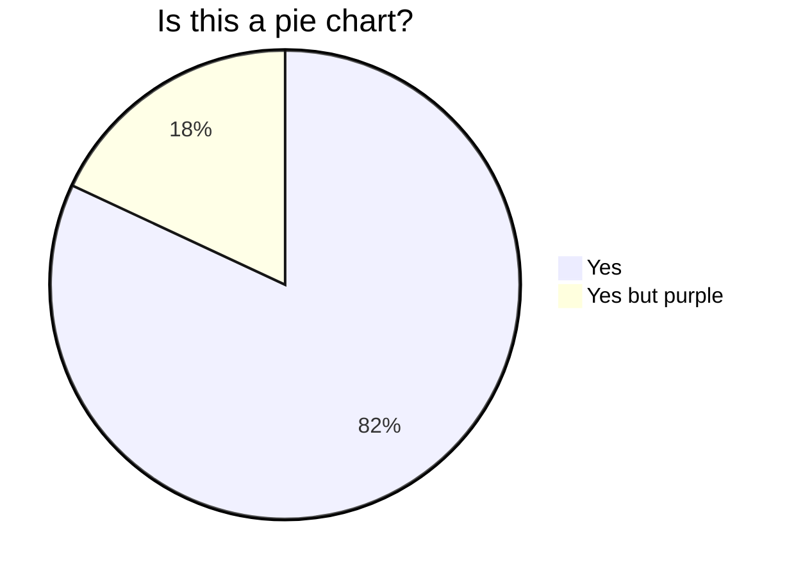

Ideas:

Pie Chart = yes, yes but yellow


```mermaid

pie title Is this a pie chart?
    "Yes" : 386
    "Yes but purple" : 85

```

```
flowchart LR

A[Hard] -->|Text| B(Round)
B --> C{Decision}
C -->|One| D[Result 1]
C -->|Two| E[Result 2]
```
