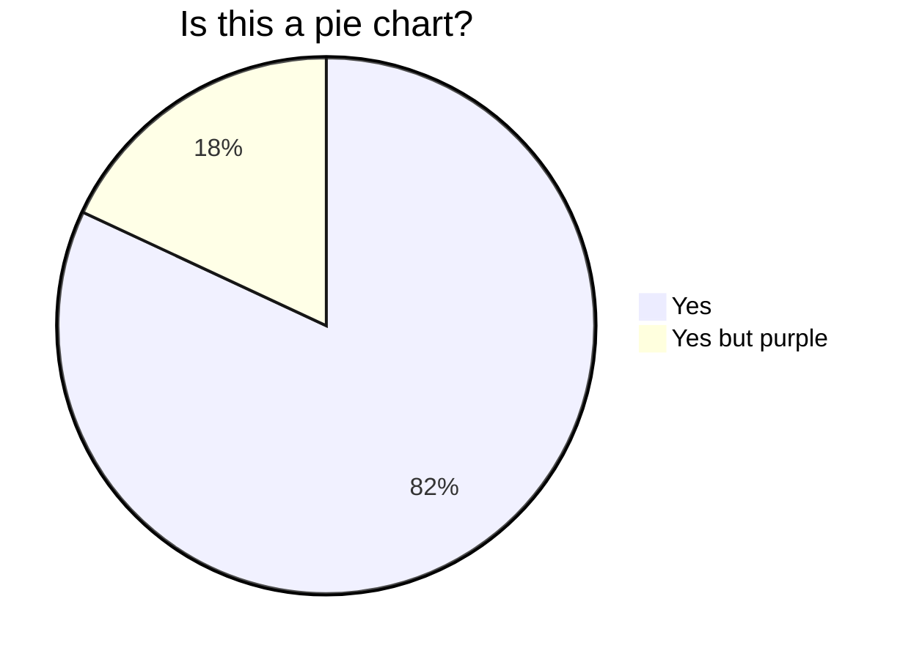

Ideas:

Pie Chart = yes, yes but yellow



```
flowchart LR

A[Hard] -->|Text| B(Round)
B --> C{Decision}
C -->|One| D[Result 1]
C -->|Two| E[Result 2]
```

https://diagramix.ai/


flowchart TD
    A[Start] --> B[Choose Topic]
    B --> C[Research Mermaid JS]
    C --> D[Outline Key Points]
    D --> E[Draft the Talk]
    E --> F[Revise the Draft]
    F --> G[Practice Delivery]
    G --> H[Gather Feedback]
    H --> I[Make Final Revisions]
    I --> J[Prepare Visual Aids]
    J --> K[Rehearse with Aids]
    K --> L[Deliver the Talk]
    L --> M[End]
