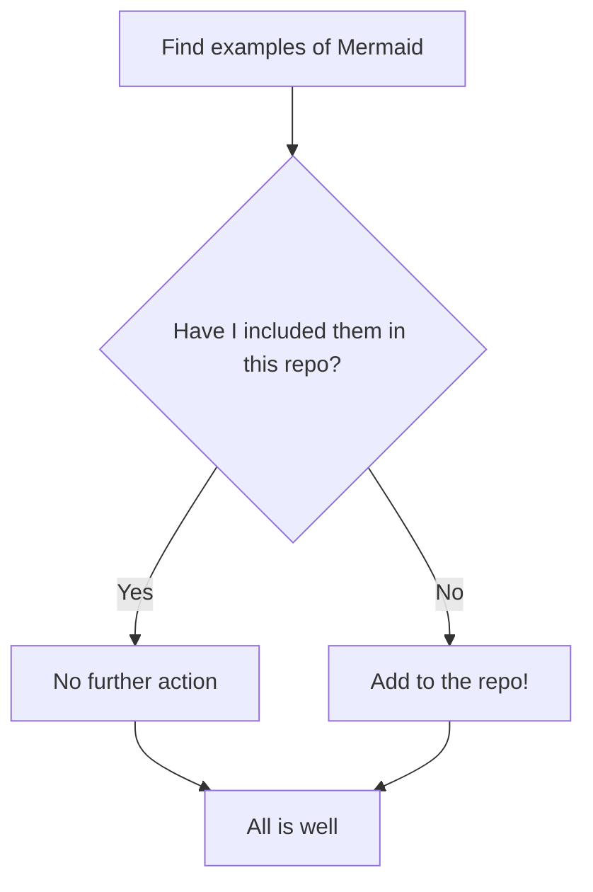

# MermaidJs

```mermaid
flowchart TD
  A[Find examples of Mermaid] --> B{Have I included them in this repo?}
B -- Yes --> C[No further action]
B -- No --> D[Add to the repo!]
C --> E[All is well]
D --> E


```
