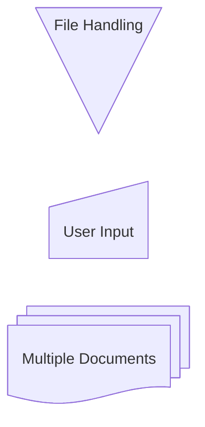

TODO: 
1. Make into component
2. Install NPM as package instead of script tag at end

CLICK EVENTS:
If you want

```javascript
mermaid.initialize({ 
    startOnLoad: true
    });
```

<hr>


<hr>


<hr>



